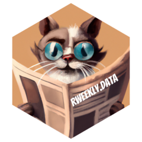

<!-- README.md is generated from README.Rmd. Please edit that file -->

# rweekly.data 

<!-- badges: start -->
<!-- badges: end -->

The goal of rweekly.data is to provide a dataset of R Weekly posts.

## Installation

You can install the development version of rweekly.data from
[GitHub](https://github.com/) with:

``` r
# install.packages("devtools")
devtools::install_github("parmsam/rweekly.data")
```

## Example

This is a basic example which shows you how to solve a common problem:

``` r
library(rweekly.data)
library(dplyr)
## basic example code
glimpse(rweekly_data)
#> Rows: 282
#> Columns: 79
#> $ title                             <chr> "R Weekly 2018-26 Chat, Highlight", …
#> $ description                       <chr> "Weekly News in the R Community.", "…
#> $ image                             <chr> "https://rweekly.org/public/facebook…
#> $ layout                            <chr> NA, NA, NA, NA, NA, NA, NA, NA, NA, …
#> $ highlight                         <list> [<"Chat with the rOpenSci team at u…
#> $ new_packages                      <list> [<"dqrng", "http://www.daqana.org/d…
#> $ package_releases                  <list> [<"vtreat 1.2.0", "https://cran.r-p…
#> $ insights                          <list> [<"Drinking from the Firehose: usin…
#> $ r_in_the_real_world               <list> [<"Really not a fish? Scraping my m…
#> $ resources                         <list> [<"Launched R for Operations Resear…
#> $ videos_and_podcasts               <list> [<"RECON R tips are online", "https…
#> $ r_in_organizations                <list> [<"Chat with the rOpenSci team at u…
#> $ tutorials                         <list> [<"Re-introduction to gghighlight: …
#> $ upcoming_events_in_3_months       <list> [<"7eme Rencontres R", "https://r20…
#> $ call_for_participation            <list> <NULL>, <NULL>, [<"Tokyo.R #71", "h…
#> $ quotes_of_the_week                <lgl> NA, NA, NA, NA, NA, NA, NA, NA, NA, …
#> $ r_internationally                 <list> <NULL>, <NULL>, [<"Faire des cartog…
#> $ r_project_updates                 <list> <NULL>, <NULL>, <NULL>, <NULL>, <NU…
#> $ r_internationally_2               <list> <NULL>, <NULL>, <NULL>, <NULL>, <NU…
#> $ gist_cookbook                     <list> <NULL>, <NULL>, <NULL>, <NULL>, <NU…
#> $ upcoming_events                   <list> <NULL>, <NULL>, <NULL>, <NULL>, <NU…
#> $ r_in_academia                     <list> <NULL>, <NULL>, <NULL>, <NULL>, <NU…
#> $ jobs                              <list> <NULL>, <NULL>, <NULL>, <NULL>, <NU…
#> $ datasets                          <list> <NULL>, <NULL>, <NULL>, <NULL>, <NU…
#> $ updated_packages                  <list> <NULL>, <NULL>, <NULL>, <NULL>, <NU…
#> $ r_in_academia_2                   <list> <NULL>, <NULL>, <NULL>, <NULL>, <NU…
#> $ highlights                        <list> <NULL>, <NULL>, <NULL>, <NULL>, <NU…
#> $ datacamp                          <list> <NULL>, <NULL>, <NULL>, <NULL>, <NU…
#> $ data_camp                         <list> <NULL>, <NULL>, <NULL>, <NULL>, <NU…
#> $ highlight_use_r_resources         <list> <NULL>, <NULL>, <NULL>, <NULL>, <NU…
#> $ use_r_2019                        <list> <NULL>, <NULL>, <NULL>, <NULL>, <NU…
#> $ highlight_2                       <list> <NULL>, <NULL>, <NULL>, <NULL>, <NU…
#> $ videos_podcasts_and_presentations <list> <NULL>, <NULL>, <NULL>, <NULL>, <NU…
#> $ note                              <lgl> NA, NA, NA, NA, NA, NA, NA, NA, NA, …
#> $ international_r                   <list> <NULL>, <NULL>, <NULL>, <NULL>, <NU…
#> $ sat_rday_johannesburg             <list> <NULL>, <NULL>, <NULL>, <NULL>, <NU…
#> $ march_2020_isc_call_for_proposals <list> <NULL>, <NULL>, <NULL>, <NULL>, <NU…
#> $ covid_19                          <list> <NULL>, <NULL>, <NULL>, <NULL>, <NU…
#> $ covid19                           <list> <NULL>, <NULL>, <NULL>, <NULL>, <NU…
#> $ black_lives_matter_support        <list> <NULL>, <NULL>, <NULL>, <NULL>, <NU…
#> $ shiny_apps                        <list> <NULL>, <NULL>, <NULL>, <NULL>, <NU…
#> $ teaching_with_r                   <list> <NULL>, <NULL>, <NULL>, <NULL>, <NU…
#> $ the_shiny_corner                  <list> <NULL>, <NULL>, <NULL>, <NULL>, <NU…
#> $ highlights_2                      <list> <NULL>, <NULL>, <NULL>, <NULL>, <NU…
#> $ resources_2                       <list> <NULL>, <NULL>, <NULL>, <NULL>, <NU…
#> $ new_packages_2                    <list> <NULL>, <NULL>, <NULL>, <NULL>, <NU…
#> $ videos_and_podcasts_2             <list> <NULL>, <NULL>, <NULL>, <NULL>, <NU…
#> $ tutorials_2                       <list> <NULL>, <NULL>, <NULL>, <NULL>, <NU…
#> $ r_project_updates_2               <list> <NULL>, <NULL>, <NULL>, <NULL>, <NU…
#> $ upcoming_events_in_3_months_2     <list> <NULL>, <NULL>, <NULL>, <NULL>, <NU…
#> $ call_for_participation_2          <list> <NULL>, <NULL>, <NULL>, <NULL>, <NU…
#> $ quotes_of_the_week_2              <lgl> NA, NA, NA, NA, NA, NA, NA, NA, NA, …
#> $ r_in_organizations_2              <list> <NULL>, <NULL>, <NULL>, <NULL>, <NU…
#> $ r_in_education                    <list> <NULL>, <NULL>, <NULL>, <NULL>, <NU…
#> $ rstudio_global_2021               <list> <NULL>, <NULL>, <NULL>, <NULL>, <NU…
#> $ a_rt                              <list> <NULL>, <NULL>, <NULL>, <NULL>, <NU…
#> $ jobs_and_funding                  <list> <NULL>, <NULL>, <NULL>, <NULL>, <NU…
#> $ shiny                             <list> <NULL>, <NULL>, <NULL>, <NULL>, <NU…
#> $ snippets                          <list> <NULL>, <NULL>, <NULL>, <NULL>, <NU…
#> $ packages                          <list> <NULL>, <NULL>, <NULL>, <NULL>, <NU…
#> $ rtistry                           <list> <NULL>, <NULL>, <NULL>, <NULL>, <NU…
#> $ a_rtistry                         <lgl> NA, NA, NA, NA, NA, NA, NA, NA, NA, …
#> $ internationally                   <list> <NULL>, <NULL>, <NULL>, <NULL>, <NU…
#> $ announcement                      <lgl> NA, NA, NA, NA, NA, NA, NA, NA, NA, …
#> $ grants_funding                    <list> <NULL>, <NULL>, <NULL>, <NULL>, <NU…
#> $ art                               <lgl> NA, NA, NA, NA, NA, NA, NA, NA, NA, …
#> $ r_in_academia_3                   <list> <NULL>, <NULL>, <NULL>, <NULL>, <NU…
#> $ rtistry_2                         <list> <NULL>, <NULL>, <NULL>, <NULL>, <NU…
#> $ insights_2                        <list> <NULL>, <NULL>, <NULL>, <NULL>, <NU…
#> $ r_in_the_real_world_2             <list> <NULL>, <NULL>, <NULL>, <NULL>, <NU…
#> $ updated_packages_2                <list> <NULL>, <NULL>, <NULL>, <NULL>, <NU…
#> $ shiny_apps_2                      <list> <NULL>, <NULL>, <NULL>, <NULL>, <NU…
#> $ jobs_2                            <lgl> NA, NA, NA, NA, NA, NA, NA, NA, NA, …
#> $ new_r_universe_articles           <list> <NULL>, <NULL>, <NULL>, <NULL>, <NU…
#> $ calls_for_participation           <list> <NULL>, <NULL>, <NULL>, <NULL>, <NU…
#> $ r_users                           <list> <NULL>, <NULL>, <NULL>, <NULL>, <NU…
#> $ rtistry_3                         <list> <NULL>, <NULL>, <NULL>, <NULL>, <NU…
#> $ r_users_2                         <list> <NULL>, <NULL>, <NULL>, <NULL>, <NU…
#> $ r_adjacent                        <list> <NULL>, <NULL>, <NULL>, <NULL>, <NU…
```

<!-- # Generate logo -->
<!-- psam::gen_hex_sticker("man/figures/cat_with_glasses.png", "man/figures/hex.png", pkg_name = "rweekly.data", txt_main_size = 37, txt_main_color = "white") -->
